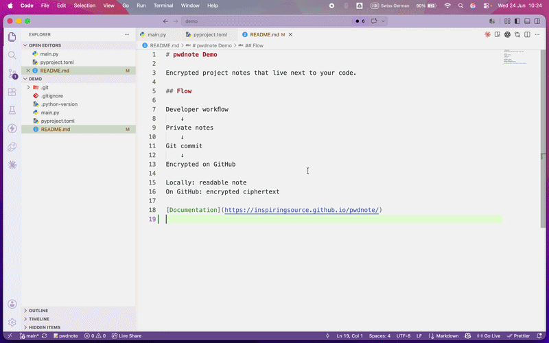

# pwdnote for VS Code

VS Code integration for [pwdnote](https://github.com/inspiringsource/pwdnote) —
encrypted, project-local notes for your terminal.

## Requirements

**pwdnote for VS Code is a frontend for the
[pwdnote](https://github.com/inspiringsource/pwdnote) command-line tool — it
requires the CLI and does nothing on its own.** The extension performs no
encryption itself; it drives the installed `pwdnote` CLI for every read and
write.

Install the CLI **first** (requires [uv](https://docs.astral.sh/uv/)):

```sh
uv tool install pwdnote
```

Then install **pwdnote** from the VS Code Marketplace (or the Extensions view).
The extension **automatically detects and uses** the `pwdnote` CLI on your
`PATH` — there is nothing to configure.

> Requires pwdnote **0.3.0 or newer**. See
> [CLI version & detection](#cli-version--detection) for how the version
> check behaves.

### Getting started

1. **Install the CLI** — `uv tool install pwdnote`.
2. **Install the VS Code extension** from the Marketplace.
3. **Open a project** folder in VS Code.
4. **Click the 📝 pwdnote status bar button** (bottom-left) to open your project
   note.

## Demo



In this demo, I create a project note directly from VS Code, add some private project context, and commit the changes to GitHub. While the note remains readable locally, only the encrypted `.pwdnote.enc` file is stored in the repository.

This extension is a **thin frontend** for the `pwdnote` command-line tool. It
does not implement encryption, define its own note format, or store secrets in
VS Code settings. All cryptography, key management, and the on-disk
`.pwdnote.enc` file are owned by the CLI. The extension simply runs the CLI from
your workspace folder and surfaces the results.

## CLI version & detection

This extension **requires the pwdnote CLI version 0.3.0 or newer** to be
installed and available on your `PATH`. The 0.3.0 release adds the
non-interactive `read` / `write --stdin` commands the extension drives.

```sh
# install
uv tool install pwdnote

# update an existing install to 0.3.0+
uv tool upgrade pwdnote
```

On activation the extension runs `pwdnote --version`. If the CLI is missing or
older than 0.3.0 you will see:

> pwdnote CLI 0.3.0 or newer is required.

…with one-click actions to copy the install and upgrade commands. The extension
does **not** attempt to install or upgrade the CLI automatically.

## Features

Available from the Command Palette (all prefixed with **pwdnote:**):

| Command | What it does | CLI used |
| --- | --- | --- |
| **pwdnote: Open Project Note** | Open the decrypted note in an editable, in-memory editor. Saving re-encrypts via the CLI. | `pwdnote read` / `pwdnote write --stdin --create` |
| **pwdnote: Initialize Project Note** | Create the encrypted project note in the current workspace. | `pwdnote init` |
| **pwdnote: Add Quick Note** | Prompt for a line of text and append it to the note. | `pwdnote add "<text>"` |
| **pwdnote: Show Status** | Show the project root, note file, and encryption status in the **pwdnote** output channel. | `pwdnote status` |

All commands run with the workspace folder as the working directory (the folder
of the active editor, falling back to the first workspace folder), because
pwdnote notes are project-local.

There is also a **📝 pwdnote** status bar item (shown when a folder is open);
clicking it runs **pwdnote: Open Project Note**.

### Read / edit / save flow

Opening the project note (via the command, the status bar item, or by clicking a
`.pwdnote.enc` file) shows the **decrypted** note in an editor tab titled
**Project Notes**, in Markdown mode:

1. The content is fetched with `pwdnote read` and held only in VS Code's
   in-memory text model — never written to disk as plaintext.
2. Edit it like any Markdown file.
3. **Save** (Ctrl/Cmd+S) pipes the current text to `pwdnote write --stdin
   --create`, which re-encrypts the `.pwdnote.enc` file. A small **"Saved"**
   status-bar message confirms success.

Clicking a `*.pwdnote.enc` file opens this decrypted view instead of showing
ciphertext.

## Current limitations

- **One note per project root.** pwdnote stores a single `.pwdnote.enc` per
  project; the extension exposes that one note.
- **No conflict detection across processes.** If you also edit the note from a
  terminal (`pwdnote edit`) while it is open in VS Code, the last save wins.
- The decrypted view is a virtual document (scheme `pwdnote:`); it is not a file
  on disk, so "Reveal in Explorer" and similar file operations do not apply to
  it. The encrypted `.pwdnote.enc` file remains the real artifact.

See [DEVELOPMENT.md](./DEVELOPMENT.md) for architecture details.

## Security model

- The extension **never** reimplements encryption — the CLI is the only engine.
- The extension **never** reads or writes the `.pwdnote.enc` bytes itself; all
  decryption/encryption goes through `pwdnote read` and `pwdnote write --stdin`.
- The extension **never** stores secrets in VS Code settings.
- Decrypted content lives only in VS Code's **in-memory** text model and is
  streamed to the CLI over stdin; it is never written to disk by the extension
  and never placed in a temporary plaintext file.
- The **pwdnote** output channel logs command execution and errors only — never
  decrypted note content, never the text of a quick note, never key material.
- Key management stays entirely with the local pwdnote CLI.

## Installing locally during development

```sh
git clone https://github.com/inspiringsource/pwdnote-vscode
cd pwdnote-vscode
npm install
npm run compile
```

Then press **F5** in VS Code ("Run Extension") to launch an Extension
Development Host with the extension loaded. Open a folder, ensure `pwdnote` is on
your `PATH`, and try the **pwdnote:** commands from the Command Palette.

To watch and rebuild on change: `npm run watch`.

## Links

- Source: <https://github.com/inspiringsource/pwdnote>
- PyPI: <https://pypi.org/project/pwdnote/>
- Docs: <https://inspiringsource.github.io/pwdnote/>

## License

MIT
